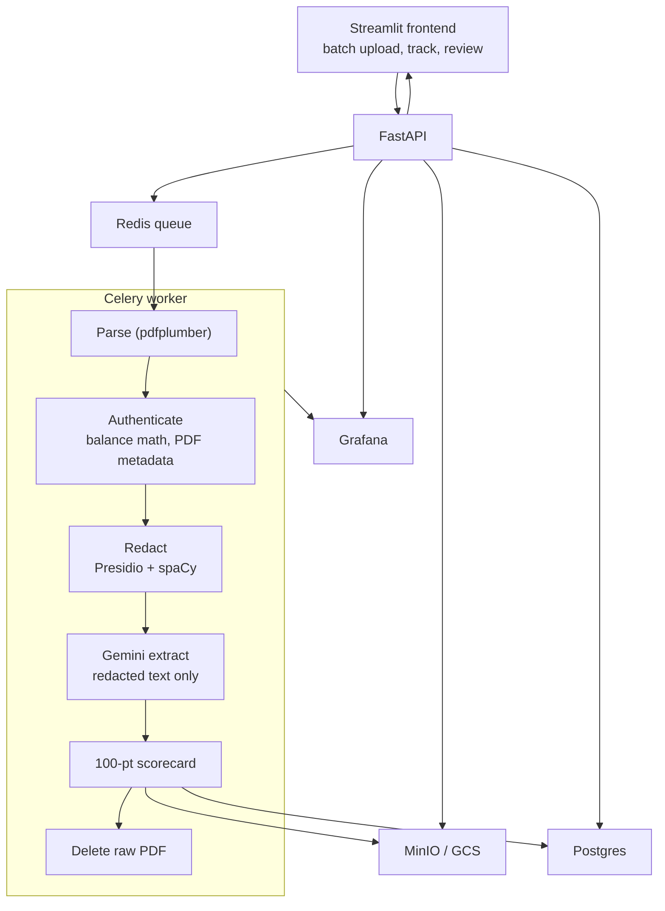

Everything these days is being automated, and the tendency to solve everything with AI has been increasing every day. One question remains: how do we protect privacy?

The project we have been working on is Sentinel, and it is focused on how banks automate the loan and credit approval procedure. Normally, when you apply for something like an American Express card, you fill out an online form with details like your SSN and income information, and sometimes upload paystubs or bank statements. You instantly get a decision with an offer, and then you decide whether to accept it or not.

In the fintech world, this entire process happens through automation. The current trend is to use Large Language Models (LLMs), but the problem is that you are providing sensitive information to the LLM when you call the API. The LLM sees your private information to make the approval decision.

We often hear about sensitive info leaking, but how does it actually leak? Personal data is at risk whenever you use standard API calls. Big tech companies are constant targets for malicious attacks, and that is when your data can get stolen. Furthermore, LLMs often store data to train and improve, so when you send sensitive information, it gets stored, at least within the context.

This is where Sentinel comes in. It acts as a shield, a layer that filters out personal information and acts as an orchestrator. It ensures the AI only receives exactly what it needs to know to evaluate an applicant. I will walk you through exactly how this works.

## The three pillars: scalability, resilience, and security

To build a system like this, we kept three core pillars in mind.

**Scalability.** Can we scale this idea to a large user base? Do we have the necessary resources? Most importantly, can we guarantee that all personal data is handled securely before it ever reaches the LLM? For us, scalability is not just about handling more users, it is about scaling our privacy promise alongside our processing power.

**Resilience.** Will the system recover if there is a potential leak or an operational error? We focused on setting up guardrails to ensure the pipeline is healthy at every step of the way. We also integrated deep observability, monitoring PII detection rates, files processed, and the time taken for each stage of the pipeline.

**Security.** How do we ensure the entire process is truly secure? We practiced strict data minimization and backed our code with rigorous testing, from unit tests to smoke tests. We looked closely at the raw input files entering the system and strictly controlled exactly what the LLM is allowed to see. This is the heart of our security architecture.

## The engine room: how it all runs so fast

Before we look at the document journey, you might wonder how this system handles hundreds of people at once without crashing.

Think about Instagram. When you double-tap a photo to like it, it feels instant, right? But in the background, a lot is happening. Instagram uses things like Redis and Celery to handle all those likes.

In our project, Redis is like the waiting room, or the queue. When you upload your files, you do not want to sit there staring at a loading screen for minutes while the AI thinks. So we drop your job into the Redis queue. Then Celery, our workers, picks up the jobs one by one and processes them in the background. This happens so fast that the app stays responsive, just like the apps you use every day.

## The architecture: the big picture

Here is how all those pieces, the frontend, the queue, and the workers, actually talk to each other. It looks like a lot, but it is really just a relay race where each part does its job and passes the baton to the next.

## The anatomy of the pipeline

Let me walk you through the actual journey of a document. It is a four-phase process that keeps everything clean and secure.

### Phase 1: ingestion and guardrails

First, we ingest the raw data. But before we do anything, we have guardrails to check: is this even a financial document? Is it legit? If it is not, we just reject it right there. This saves us from wasting resources on parsing, redacting, or making expensive LLM API calls. We authenticate first so we only process what matters.

### Phase 2: the privacy guard

This is where we use spaCy and Presidio, Microsoft's open source SDK. These are NLP engines that find PII through text vectorization. Now, you might think, wait, if we are using Microsoft's stuff, is the data at risk? Actually, no. We are not making API calls to them. We install the SDK and libraries locally. It is our own instance, no internet involved.

We set up spaCy to do the heavy lifting, and just in case it misses something, Presidio acts like a second scan or an inspection. It is fast, efficient, and proves that we can solve the privacy problem with the right setup.

### Phase 3: controlled extraction

Now that the file is redacted, Gemini takes a look. It sees something like: "Okay, the user's income is [REDACTED], and their transactions look clean." It extracts the structured info we need and passes it to the next stage to see how they do on the scoreboard.

### Phase 4: deterministic scoring

This is where we follow the standard rules fintechs use. We check for overdrafts, shady transactions, and income proof. Everything turns into a 100-point scoring system.

The threshold is 80. If you score 80 or above, you are automatically approved. If files are missing or the score is lower, it goes to a human reviewer to check the files. And if things look really shady, it is a total rejection. This way, we are not just letting the AI decide everything. We are using math and giving people a real explanation if they do not get the offer.

## Moving to the cloud: the real challenge

Moving this whole thing from my laptop to Google Cloud was a big step. You know how people always say "it works on my machine"? Well, the cloud is a totally different world. We had to make sure all our different parts could talk to each other in the cloud just like they did at home. It ended up as three Cloud Run services with CI/CD through GitHub Actions.

One of the most important things was handling our API keys. These keys are like the password to our Gemini AI, so they are sensitive. We could not just leave them sitting in the code where anyone could see them.

Instead, we used GitHub Actions secrets to handle the deployment and Google Secret Manager to store the keys in a digital vault. This means the actual keys are never in our source code. When the system starts up in the cloud, it requests the keys it needs on the fly. We also set it up so that each part of our system only has permission to see the specific keys it needs to do its job, nothing more.

On top of that, a Grafana dashboard tracks throughput, failures, and redaction counts, so you can actually see the pipeline doing what we claim it does.

## The finish line

Building this was a huge learning curve. The MVP is on par and is performing as expected. It could be more refined by having rulesets and criteria, like how many files do we accept for proof of income? Is it just paystubs, or bank statements too? Do we need W-2 forms? Having clear criteria helps us build a policy first, which we can then use in our software to evaluate our customers and build that mutual trust.

Code is at [Khey17/sentinel-nextgenai-execution-layer](https://github.com/Khey17/sentinel-nextgenai-execution-layer), and the original writeup is on [LinkedIn](https://www.linkedin.com/pulse/building-sentinel-nextgenai-execution-layer-karthikheyaa-kurra-nwm5e/).
