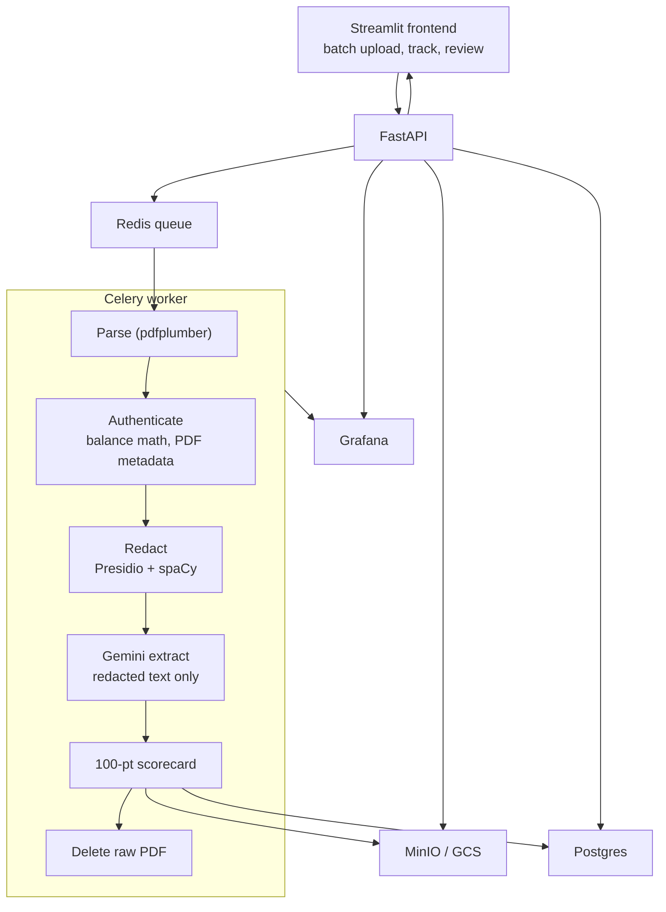

This was the intern project I did with Best Egg at UD (advisor: Mike Urban). The resume version is short: process bank statements, paystubs, and tax docs, keep personal information off the model, score applications, put guardrails on bad files, and ship it on Cloud Run with Grafana.

This post is how that actually worked.

Everything these days is being automated, and the tendency to solve everything with AI has been increasing every day. One question remains: how do we protect privacy?

Normally, when you apply for something like a credit card, you fill out an online form with details like your SSN and income, and sometimes upload paystubs or bank statements. You get a decision pretty quickly. In fintech that whole flow is automated. The current trend is to throw an LLM at it, but then you are sending sensitive information to the model when you call the API.

We often hear about leaks, but the boring version is simpler: once you put PII in a standard API call, you do not really control where it sits. Models also keep context, so the data is at least around for the duration of the request.

Sentinel is a layer in front of that. It filters personal information and orchestrates the rest of the pipeline so the model only sees what it needs to evaluate the file.

Code: [Khey17/sentinel-nextgenai-execution-layer](https://github.com/Khey17/sentinel-nextgenai-execution-layer). Longer writeup is also on [LinkedIn](https://www.linkedin.com/pulse/building-sentinel-nextgenai-execution-layer-karthikheyaa-kurra-nwm5e/).

## Three things we could not trade off

**Scalability.** Can this handle a bunch of uploads at once, and is the privacy step still in place when it does? Batch upload, a job queue, and more workers if we need them.

**Resilience.** If a step fails, does the job die quietly? We added retries, an audit trail per step, and a Grafana dashboard for throughput, failures, and how many things got redacted.

**Security.** The LLM is not allowed to see raw PII. That is enforced by pipeline order, not by hoping someone remembers. We also deleted raw files after processing, wrote tests, and looked at what actually entered the system.

## Why it stays responsive

If you upload a PDF and wait for the model on the same request, the page just sits there. We did not want that.

Redis is the waiting room. The API drops the job on a queue and returns. Celery workers pick jobs up in the background and run parse → authenticate → redact → extract → score. Same idea as a like button that feels instant while work happens behind it.

## The pipeline

**Ingestion and guardrails.** Before we spend time parsing or calling a model, we check whether this is even a financial document. Wrong file type, garbage, or a flight receipt: reject it early.

**Redaction.** spaCy and Microsoft Presidio run locally. No API call to Microsoft. spaCy does the first pass; Presidio is a second look. Names, SSNs, account numbers get replaced with placeholders before anything goes to the model.

**Extraction.** Gemini only sees the redacted text. It pulls structured fields (income, balances, flags) for the scorecard. That is the “AI” part. It never gets the raw PDF.

**Scoring.** After extraction we do not let the model decide yes/no. There is a 100-point scorecard with named reason codes (overdrafts, missing income proof, etc.). The threshold we used is 95. At or above that, it can pass. Below that, or if files are missing, it goes to a human reviewer. Obviously bogus files get rejected. If someone is not approved, there is a reason, not “the model said so.”

## Cloud

Local Docker Compose is one thing. Google Cloud is another. We deployed it as three Cloud Run services (API, worker, frontend) with CI/CD through GitHub Actions.

API keys for Gemini do not live in the repo. GitHub Actions secrets handle deploy credentials. Google Secret Manager holds the keys, and each service only gets what it needs at runtime.

Grafana tracks throughput, failures, and redaction counts so you can see the pipeline is actually doing what we claim.

## What I would tighten next

The MVP runs. What I would add is clearer policy: how many files count as income proof, whether it is just paystubs or bank statements too, whether we want W-2s. Write the rules first, then encode them.

Repo: [github.com/Khey17/sentinel-nextgenai-execution-layer](https://github.com/Khey17/sentinel-nextgenai-execution-layer)
